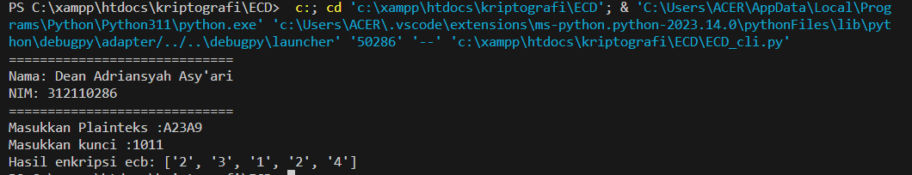
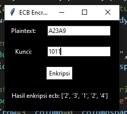

# **Kriptography**
**Nama :** *Dean Adriansyah Asy'ari* 

**NIM :** *312110286* 

**Kelas :** *TI.21.A2*

**Teknik Informatika - UNIVERSITAS PELITA BANGSA**

---


# <p align="center">Tugas P13 Kriptografi ~ Electronic Code Book (ECD)</p>

- Kode Electronic Code Book (ECD) CLI:

```python
def hex_to_bin(hex_val):
    return bin(int(hex_val, 16))[2:].zfill(4)

def bin_to_hex(bin_val):
    return hex(int(bin_val, 2))[2:]

def shift_left(bin_val):
    return bin_val[1:] + bin_val[0]

def xor(bin_val, key):
    return ''.join('1' if b != k else '0' for b, k in zip(bin_val, key))

def ecb_encrypt(plaintext, key):
    plaintext = [hex_to_bin(c) for c in plaintext]
    key = key.zfill(4)
    ciphertext = []
    for block in plaintext:
        xor_result = xor(block, key)
        shifted = shift_left(xor_result)
        ciphertext.append(bin_to_hex(shifted))
    return ciphertext

# Ganti dengan nama dan nim Anda
print("=============================")
print("Nama: Dean Adriansyah Asy'ari")
print("NIM: 312110286")
print("=============================")

plaintext = input("Masukkan Plainteks :")
key = input("Masukkan kunci :")
ciphertext = ecb_encrypt(plaintext, key)
print("Hasil enkripsi ecb:", ciphertext)
```

- Hasil Kode Electronic Code Book (ECD) CLI:



- Kode Electronic Code Book (ECD) GUI:

```python
import tkinter as tk
from tkinter import Label, Entry, Button

def hex_to_bin(hex_val):
    return bin(int(hex_val, 16))[2:].zfill(4)

def bin_to_hex(bin_val):
    return hex(int(bin_val, 2))[2:]

def shift_left(bin_val):
    return bin_val[1:] + bin_val[0]

def xor(bin_val, key):
    return ''.join('1' if b != k else '0' for b, k in zip(bin_val, key))

def ecb_encrypt(plaintext, key):
    plaintext = [hex_to_bin(c) for c in plaintext]
    key = key.zfill(4)
    ciphertext = []
    for block in plaintext:
        xor_result = xor(block, key)
        shifted = shift_left(xor_result)
        ciphertext.append(bin_to_hex(shifted))
    return ciphertext

def encrypt_button_click():
    plaintext = plaintext_entry.get()
    key = key_entry.get()
    ciphertext = ecb_encrypt(plaintext, key)
    result_label.config(text="Hasil enkripsi ecb: {}".format(ciphertext))

# Membuat GUI
app = tk.Tk()
app.title("ECB Encryption")
app.configure(bg="black")  # Mengatur latar belakang menjadi hitam

# Membuat label dan entry untuk plaintext
plaintext_label = Label(app, text="Plaintext:", fg="white", bg="black")  # Mengatur teks dan latar belakang
plaintext_label.grid(row=0, column=0, padx=10, pady=10)
plaintext_entry = Entry(app, bg="white")  # Mengatur latar belakang entry
plaintext_entry.grid(row=0, column=1, padx=10, pady=10)

# Membuat label dan entry untuk kunci
key_label = Label(app, text="Kunci:", fg="white", bg="black")  # Mengatur teks dan latar belakang
key_label.grid(row=1, column=0, padx=10, pady=10)
key_entry = Entry(app, bg="white")  # Mengatur latar belakang entry
key_entry.grid(row=1, column=1, padx=10, pady=10)

# Membuat tombol enkripsi
encrypt_button = Button(app, text="Enkripsi", command=encrypt_button_click, bg="white", fg="black")  # Mengatur teks dan latar belakang tombol
encrypt_button.grid(row=2, column=0, columnspan=2, pady=10)

# Membuat label untuk menampilkan hasil enkripsi
result_label = Label(app, text="", fg="white", bg="black")  # Mengatur teks dan latar belakang
result_label.grid(row=3, column=0, columnspan=2, pady=10)

# Menjalankan aplikasi GUI
app.mainloop()
```

- Hasil Kode Electronic Code Book (ECD) GUI:




